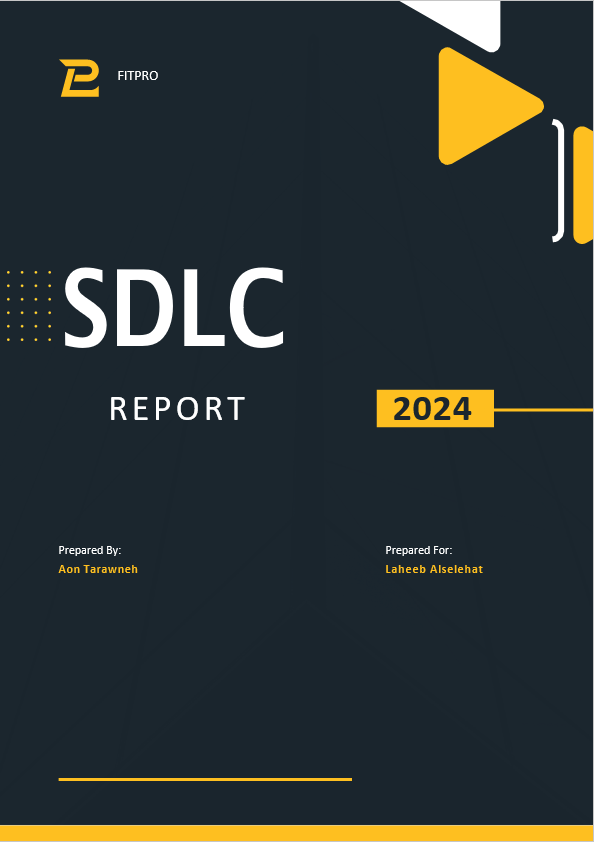
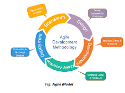
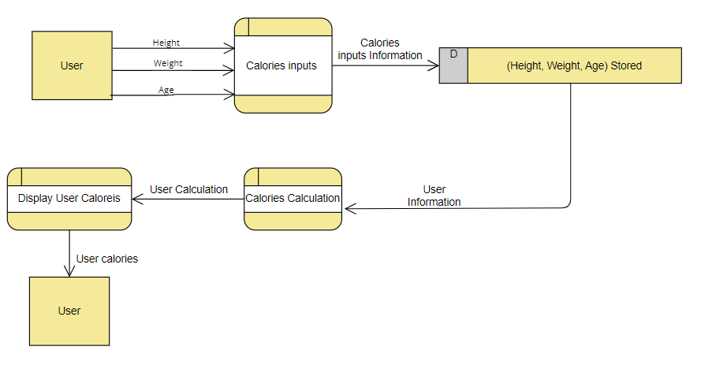
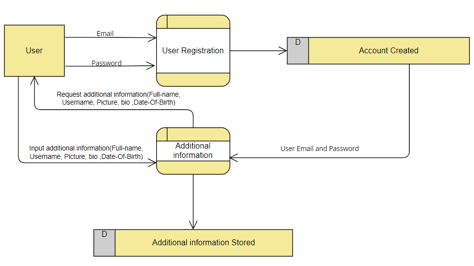
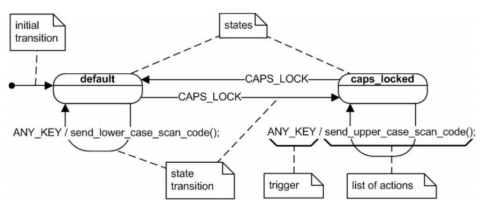
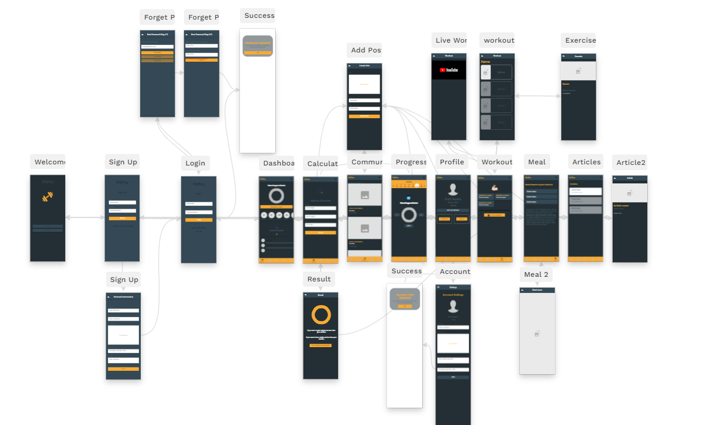

# FitPro - Fitness Management System

FitPro is a comprehensive, personalized health and fitness application designed to help users achieve their wellness goals. Developed using the Agile Software Development Life Cycle (SDLC) model, it integrates personalized workout and nutrition plans, community engagement, and progress tracking.



## 📋 Table of Contents
- [Introduction](#introduction)
- [Software Development Life Cycle (SDLC)](#software-development-life-cycle-sdlc)
- [Feasibility Study](#feasibility-study)
- [System Features](#system-features)
- [System Design & Architecture](#system-design--architecture)
- [Implementation Details](#implementation-details)
- [Adalo Prototype](#adalo-prototype)

---

## 🚀 Introduction
FitPro is not just an app; it's a tailored health guide. In the ever-evolving fitness landscape, FitPro stands out by offering:
- **Customized Workout & Food Programs**
- **Progress Tracking & Water Intake Monitoring**
- **Live Workouts with Expert Guidance**
- **Expert Articles on Wellness and Nutrition**
- **Supportive Community Interaction**

## 🔄 Software Development Life Cycle (SDLC)
FitPro adopted the **Agile Model** for its development. This choice was driven by the need for:
1. **Adaptability:** Allowing real-time adjustments based on user feedback.
2. **Early Validation:** Reducing risks through iterative testing.
3. **User-Centric Focus:** Prioritizing customer satisfaction through frequent delivery.



## 📊 Feasibility Study
A thorough feasibility analysis was conducted across five key criteria:
1. **Legal:** Compliance with GDPR/CCPA and data privacy laws.
2. **Economic:** Cost-benefit analysis including ROI projections.
3. **Technical:** Evaluation of cross-platform compatibility and cloud services (Google Cloud).
4. **Operational:** Assessing organizational readiness and scalability.
5. **Scheduling:** Ensuring timely delivery within project milestones.

## ✨ System Features

### 1. User Registration & Profile Management
Users can create accounts, set goals, and manage their physical metrics (age, height, weight).


### 2. Personalized Workout Plans
Tailored routines based on goals, fitness levels, and available equipment.


### 3. Nutrition & Calorie Tracking
Customized meal plans and a dedicated calorie calculator.


### 4. Progress Monitoring
Interactive charts for tracking metrics like water intake and workout consistency.


### 5. Community & Expert Insights
A platform for users to share experiences and access verified articles from health professionals.


## 🏗️ System Design & Architecture

### Data Flow Diagram (DFD)
The system's data flow ensures secure and efficient handling of user information and health metrics.


### Flowcharts & Logic
Detailed flowcharts map the user journey from onboarding to daily activities.


### State Machine Diagram
Defines the behavior of the application across different user states.


## 💻 Implementation Details

### Technology Stack
- **Platform:** Cross-platform (iOS & Android)
- **Database:** Firebase / MongoDB
- **Security:** End-to-end encryption, multi-factor authentication
- **Cloud Services:** Google Cloud for scalability

### Pseudocode Preview
```pseudocode
START
DISPLAY welcome page with buttons: "Sign up", "Log in"
WHEN "Sign up" button clicked:
    COLLECT (email, name, age, height, weight)
    ENFORCE strong password
    STORE in database
...
```

## 📱 Adalo Prototype
The live prototype of FitPro is built on Adalo, showcasing the UI/UX design and core functionality.

**🔗 [View Live Prototype](https://aon-tarawnehs-team.adalo.com/fitpro-1)**



---

## 👨‍💻 Prepared By
**Aon Tarawneh**
*Software Development Life Cycle Report - 2024*
